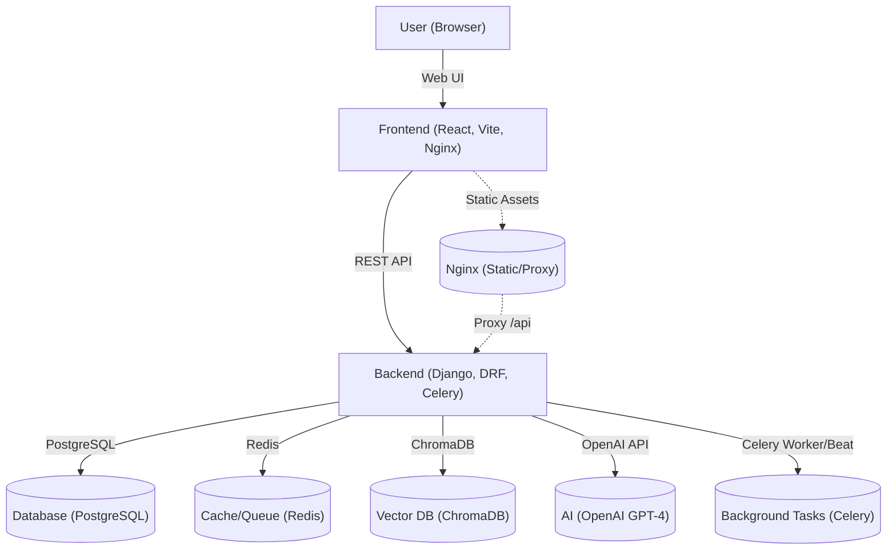

# News Tag Navigator AI

**AI-powered platform for analyzing, tagging, and navigating financial news and market signals.**

---

## Table of Contents

- [Overview](#overview)
- [Features](#features)
- [Architecture](#architecture)
- [Tech Stack](#tech-stack)
- [Project Structure](#project-structure)
- [Setup & Installation](#setup--installation)
  - [Environment Variables](#environment-variables)
  - [Running with Docker](#running-with-docker)
  - [Manual Local Development](#manual-local-development)
- [API Endpoints](#api-endpoints)
- [Frontend Usage](#frontend-usage)
- [Data Ingestion & AI](#data-ingestion--ai)
- [Contributing](#contributing)
- [License](#license)

---

## Overview

**News Tag Navigator AI** is a full-stack application that leverages AI (OpenAI GPT-4) to analyze financial news, tag articles with relevant sectors, stocks, sentiment, and impact, and generate actionable market signals. The platform provides a modern web interface for filtering, searching, and exploring news and signals.

---

## Features

- **AI-driven News Analysis:** Automatically tags news articles with sectors, stocks, sentiment (positive/negative/neutral), and impact (high/medium/low).
- **Market Signals:** Generates and displays actionable signals based on news and data.
- **Advanced Filtering:** Filter news by sector, stock, sentiment, and search queries.
- **Real-time Updates:** News and signals are updated automatically.
- **Modern UI:** Responsive React frontend with advanced UI components.
- **API-first:** RESTful API with auto-generated Swagger and Redoc documentation.
- **Scalable Architecture:** Dockerized, supports Celery for background tasks, Redis for caching, and ChromaDB for vector storage.

---

## Architecture



---

## Tech Stack

- **Frontend:** React (Vite, TypeScript), Tailwind CSS, Lucide Icons
- **Backend:** Django, Django REST Framework, Celery, ChromaDB, OpenAI API
- **Database:** PostgreSQL
- **Cache/Queue:** Redis
- **Vector DB:** ChromaDB
- **Containerization:** Docker, Docker Compose
- **Web Server:** Nginx (for frontend static serving & API proxy)

---

## Project Structure

```
news-tag-navigator-ai/
  backend/                # Django backend (API, AI, tasks)
    ai/                   # AI models, serializers, views, utils
    core/                 # Django project settings, URLs, celery
    scrapy/               # News scraping and ingestion
    data/                 # Data files and scripts
    static/               # Static files
    manage.py
    requirements.txt
  data/                   # Shared data (e.g., stock_universe.csv)
  news-tag-navigator-ai/  # Frontend (React)
    public/               # Static assets
    src/
      components/         # React components (UI, NewsCard, etc.)
      hooks/              # Custom React hooks
      lib/                # Frontend utilities
      pages/              # Main pages (Index, NotFound)
    nginx.conf            # Nginx config for frontend+API proxy
  docker-compose.yml      # Multi-service orchestration
  Dockerfile.backend      # Backend build
  Dockerfile.frontend     # Frontend build
```

---

## Setup & Installation

### Prerequisites

- [Docker](https://www.docker.com/) and [Docker Compose](https://docs.docker.com/compose/)
- OpenAI API key (for AI features)

### Environment Variables

Create a `.env` file in the root with the following (example):

```
POSTGRES_DB=newsdb
POSTGRES_USER=newsuser
POSTGRES_PASSWORD=yourpassword
DJANGO_DB_HOST=db
DJANGO_DB_NAME=newsdb
DJANGO_DB_USER=newsuser
DJANGO_DB_PASSWORD=yourpassword
DJANGO_SECRET_KEY=your-django-secret
CELERY_BROKER_URL=redis://redis:6379/0
OPENAI_API_KEY=sk-...
DEBUG=1
```

### Running with Docker

1. **Build and start all services:**

   ```sh
   docker-compose up --build
   ```

2. **Access the app:**
   - Frontend: [http://localhost:3000](http://localhost:3000)
   - Backend API: [http://localhost:8001/api/](http://localhost:8001/api/)
   - Swagger docs: [http://localhost:8001/swagger/](http://localhost:8001/swagger/)
   - Redoc docs: [http://localhost:8001/redoc/](http://localhost:8001/redoc/)

3. **Services launched:**
   - `frontend` (React + Nginx)
   - `backend` (Django + Gunicorn)
   - `db` (PostgreSQL)
   - `redis` (Redis)
   - `worker` (Celery worker)
   - `scheduler` (Celery beat)
   - `chromadb` (Vector DB)
   - `chromadb_init` (Initializes ChromaDB with stock universe)

### Manual Local Development

- **Backend:**  
  ```sh
  cd backend
  pip install -r requirements.txt
  python manage.py migrate
  python manage.py runserver
  ```
- **Frontend:**  
  ```sh
  cd news-tag-navigator-ai
  npm install
  npm run dev
  ```

---

## API Endpoints

- **Base URL:** `/api/`

| Endpoint             | Method | Description                        |
|----------------------|--------|------------------------------------|
| `/signals/`          | GET    | List all market signals            |
| `/analyzed-news/`    | GET    | List all analyzed news articles    |
| `/swagger/`          | GET    | Swagger API docs                   |
| `/redoc/`            | GET    | Redoc API docs                     |

- **Example News Article Object:**
  ```json
  {
    "id": "123",
    "title": "Market rallies on tech earnings",
    "summary": "...",
    "content": "...",
    "publishedAt": "2024-06-01T12:00:00Z",
    "source": "Reuters",
    "url": "https://...",
    "tags": {
      "sectors": ["Technology"],
      "stocks": ["AAPL", "MSFT"],
      "sentiment": "positive",
      "impact": "high"
    }
  }
  ```

---

## Frontend Usage

- **Homepage:**  
  - Search and filter news by sector, stock, and sentiment.
  - View market signals and stats overview.
  - Responsive design for desktop and mobile.

- **Filtering:**  
  - Use the sidebar to filter by sector, stock, or sentiment.
  - Active filters are shown and can be cleared individually or all at once.

- **Signals:**  
  - View actionable signals generated by the AI backend.

---

## Data Ingestion & AI

- **News Scraping:**  
  - Scrapy-based modules ingest news from sources (e.g., Economic Times).
- **AI Tagging:**  
  - News articles are analyzed and tagged using OpenAI GPT-4 via the backend.
- **Stock Universe:**  
  - The stock universe is loaded from `data/stock_universe.csv` and ingested into ChromaDB for vector search and tagging.

---

## Contributing

1. Fork the repo
2. Create your feature branch (`git checkout -b feature/fooBar`)
3. Commit your changes (`git commit -am 'Add some fooBar'`)
4. Push to the branch (`git push origin feature/fooBar`)
5. Create a new Pull Request

---

## License

[MIT](LICENSE)

---

**For questions or support, please open an issue or contact the maintainers.** 